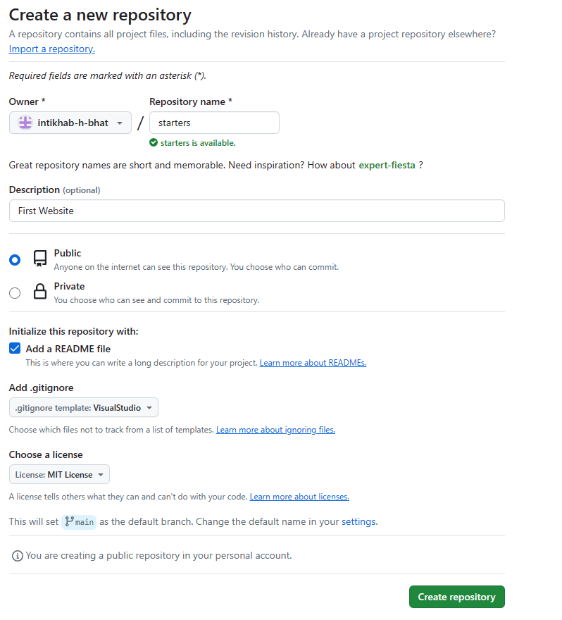
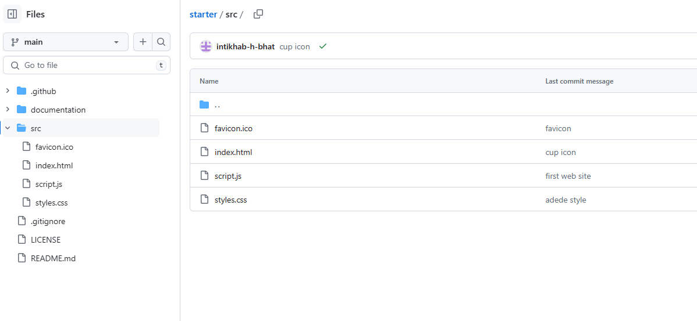
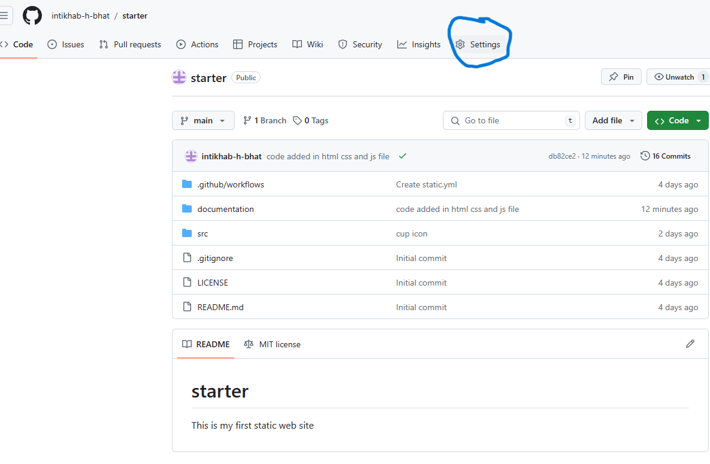
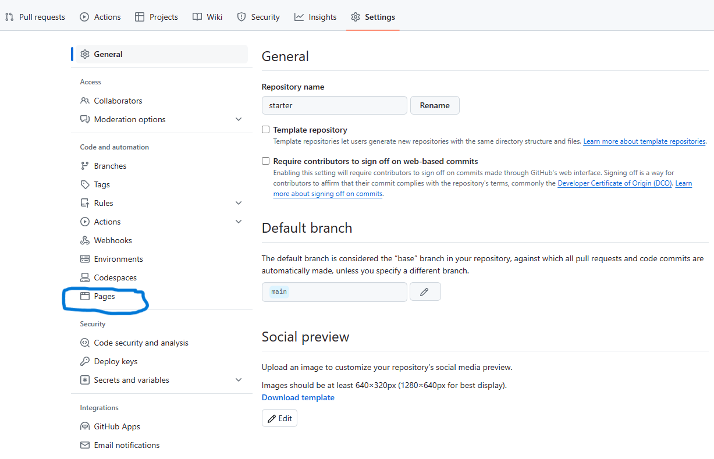
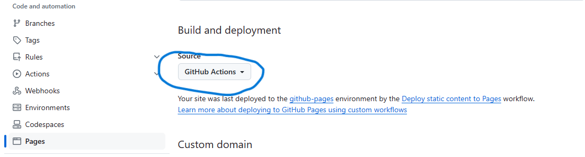
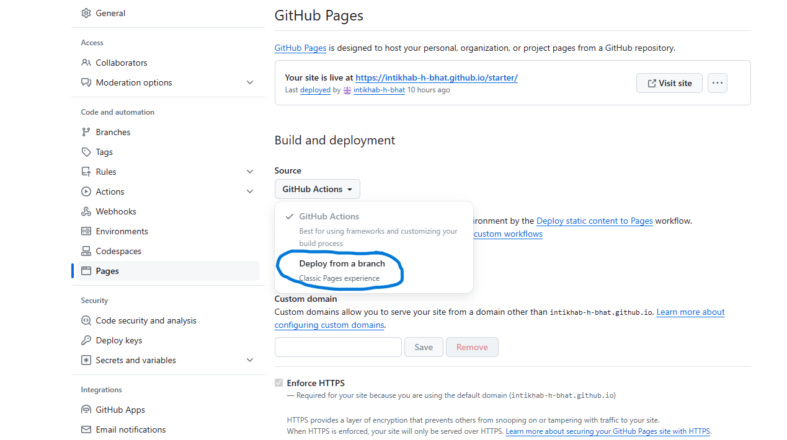
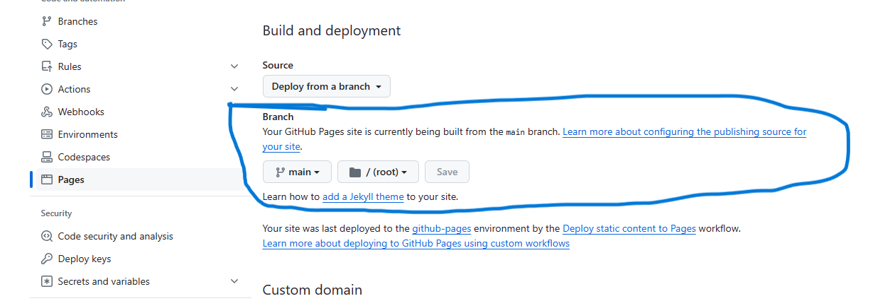
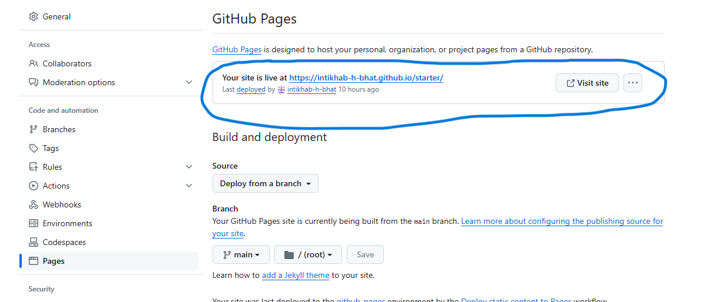

# How to host website in GitHub using pages

---

## Step 1

1. Create Repositary
2. Add desription
3. Select the **public** radio button
4. select the checkbox "<mark>**Add a README file**</mark>"
5. In .gitignore dropdown select "<mark>**VisualStudio**</mark>"
6. In the choose a licence dropdown select "<mark>**MIT License**</mark>"
7. Then click on **Create repositary** button

   See image below


---

## Step 2

1. create folder "**src**"
2. In this folder create  html file "**index.html**" javascriptfile "**script.js**" and css file "**styles.css**"

See image below

---

Step 3

### write  code in **index.html** , **script.js** and **styles.css**

## index.html

```<!DOCTYPE html>
<html lang="en">
  <head>
    <meta charset="UTF-8" />
    <meta name="viewport" content="width=device-width, initial-scale=1.0" />
    <link rel="icon" href="favicon.ico" type="image/x-icon" />
    <title>Coffee Shop</title>
    <link
      rel="stylesheet"
      href="https://cdnjs.cloudflare.com/ajax/libs/font-awesome/6.5.2/css/all.min.css"
      integrity="sha512-SnH5WK+bZxgPHs44uWIX+LLJAJ9/2PkPKZ5QiAj6Ta86w+fsb2TkcmfRyVX3pBnMFcV7oQPJkl9QevSCWr3W6A=="
      crossorigin="anonymous"
      referrerpolicy="no-referrer"
    />
    <link rel="stylesheet" href="styles.css" />
  </head>
  <body>
    <div>
      <h1>Intikhabs Coffee Shop <i class="fa-solid fa-mug-hot"></i></h1>
      <h1><i class="fa-solid fa-laptop"></i></h1>
    </div>
    <script src="script.js"></script>
  </body>
</html>

```

## script.js

```
console.log(`${Date()} :: This is a starter template for a simple web app.`);
```

## styles.css

```
@import url("https://fonts.googleapis.com/css2?family=Roboto:wght@400;700&display=swap");
@import url("https://fonts.googleapis.com/css2?family=Montserrat:wght@900&display=swap");

* {
  box-sizing: border-box;
}

body {
  font-family: "Roboto", "Montserrat", sans-serif;
  display: flex;
  flex-direction: column;
  align-items: center;
  height: 100vh;
  justify-content: center;
  overflow: hidden;
  margin: 0;
}

h1 {
  font-size: 3rem;
  margin-bottom: 1rem;
  color: #1c1678;
}

i {
  font-size: 5rem;
  margin-bottom: 1rem;
  color: blueviolet;
}

```

---

# Step 4

## To publish website

1. go to **settings**

   

2. Then click on **pages** on the sidebar menu

   

3. After that click on **GitHub Actions** dropdown

   

4. In dropdown click **Deploy from Branch**
   
   

5. select the branch from where you want to publish site.
   
   

6. After some time the website link will apear at the top.
   
   

7. click the link to open the website.
   
   